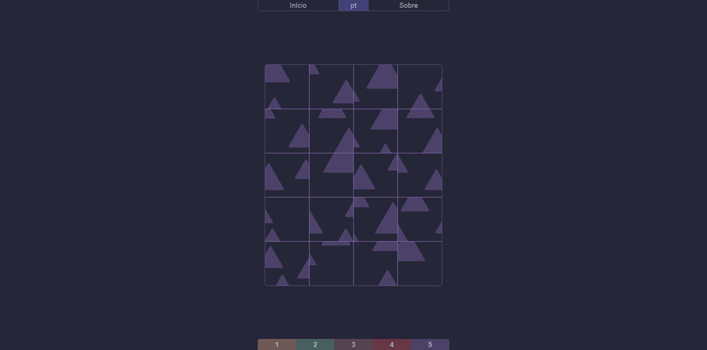

Ler em português 🇧🇷

# Scrollzz 🧩

Scrollzz é um jogo de quebra-cabeças minimalista e geométrico que se baseia apenas no movimento de scroll. Deixe a sua estrela no repositório se curtiu o projeto e confira o resultado em [refusado.github.io/scrollzz](https://refusado.github.io/scrollzz/)

O puzzle foi desenvolvido exclusivamente em CSS, todo o projeto é composto por apenas HTML e folhas de estilo, sem tags de script!

  
## Autor ✍️

Refu

- [Discord](https://discord.com/users/412685400847679508)
- [Github](https://github.com/refusado)
- [Youtube](https://www.youtube.com/@refusado)
- [Email](mailto:refusado@gmail.com)
- [Twitter](https://twitter.com/refusado)

## Versão 🔄

Updates trazidos para segunda versão:

  - Melhor arquitetura de projeto;
  - Suporte para mobile;
  - Melhor curva de dificuldade entre os níveis;
  - 100% responsivo - funciona em qualquer tela;
  - Melhorias no design de peças e níveis;
  - Sistema de tradução de textos;
  - Textos em inglês além do português;
  - Melhor compatibilidade entre os navegadores.

## Licença 🔓

O Scrollzz é distribuído sob a Licença MIT. Consulte o arquivo [LICENSE](https://github.com/refusado/scrollzz/blob/main/LICENSE) para obter mais informações sobre os termos de uso.

---

# Scrollzz 🧩

Scrollzz is a minimalistic, geometric puzzle that is based on scrolling movement. Star the repository if you like it and check out the result at [refusado.github.io/scrollzz](https://refusado.github.io/scrollzz/)

The game was developed exclusively in CSS, the whole project consists of HTML and style sheets only, no script tags!

  
## Author ✍️

Refu

- [Discord](https://discord.com/users/412685400847679508)
- [Github](https://github.com/refusado)
- [Youtube](https://www.youtube.com/@refusado)
- [Email](mailto:refusado@gmail.com)
- [Twitter](https://twitter.com/refusado)

## Version 🔄

Updates brought to second version:

  - Better design architecture;
  - Mobile support;
  - Better difficulty curve between levels;
  - 100% responsive - works on any screen;
  - Design improvements for pieces and levels;
  - Text translation system;
  - English texts in addition to Portuguese;
  - Better compatibility between browsers.

## License 🔓

Scrollzz is distributed under the MIT License. See the [LICENSE](https://github.com/refusado/scrollzz/blob/main/LICENSE) file for more information about the terms of use.
